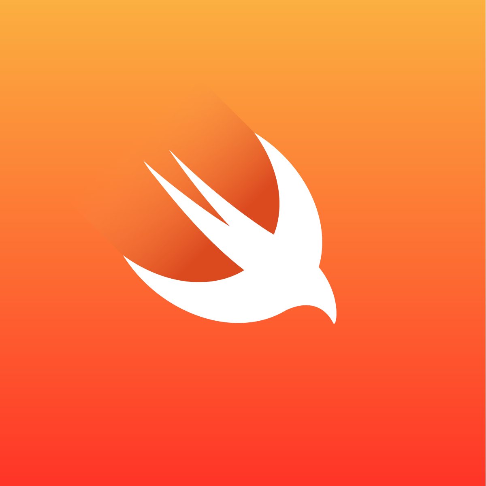

#A personalized iOS application stack built using Swift programming language, leveraging UIKit and SwiftUI for UI development, ARKit for augmented reality features, CocoaPods and Swift Package Manager for dependency management, CoreML for machine learning integration, and CoreData for local data persistence.

