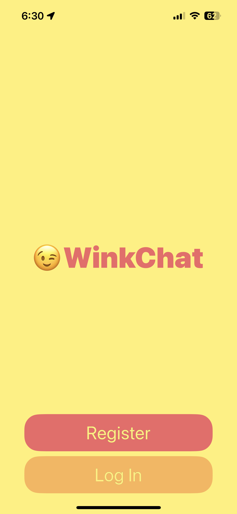
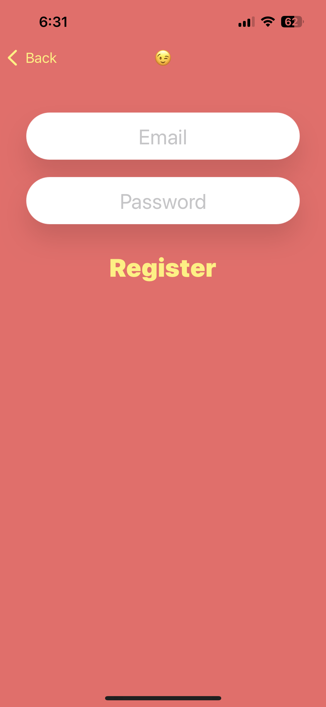
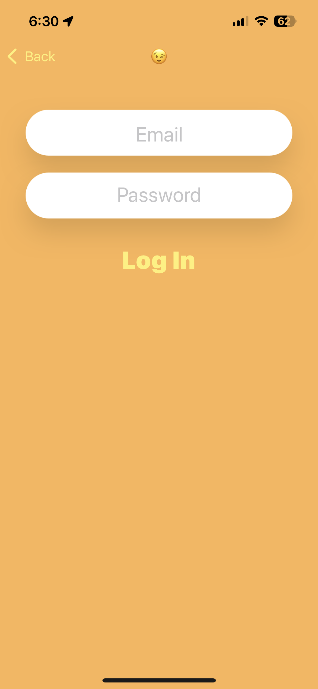
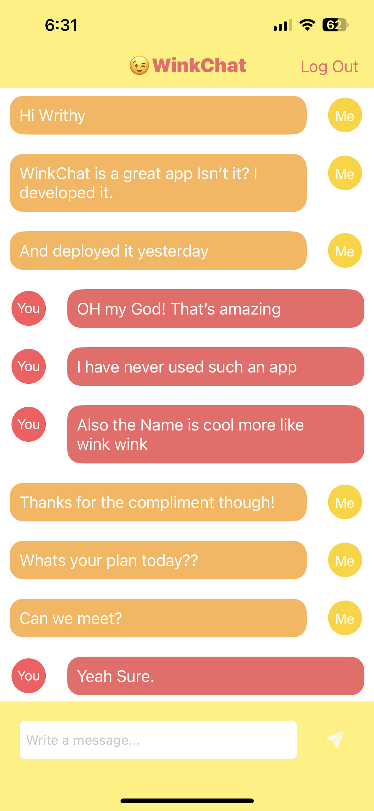

# Main Features
WinkChat is an internet based messaging app similar to WhatsApp, where I used a service called Firebase Firestore as a backend database to store and retrieve our messages from the cloud. 

# Icon:

# App Interfaces:

  &nbsp;
  &nbsp;
  &nbsp;
  

